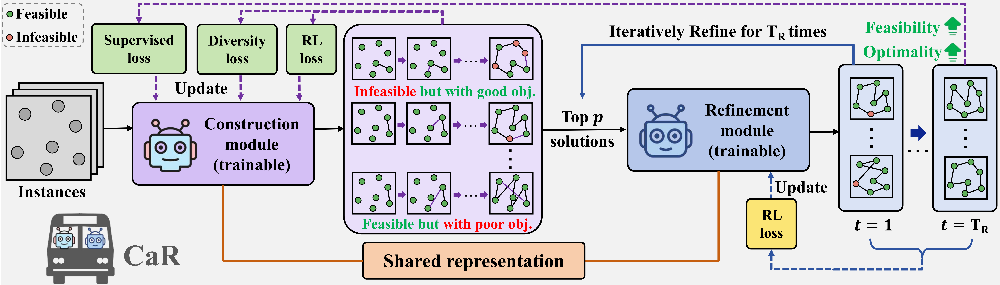

<h1 align="center"> Towards Efficient Constraint Handling in Neural Solvers for Routing Problems </h1>

<p align="center">
<a href="https://iclr.cc/"></a>&nbsp;&nbsp;&nbsp;&nbsp;
<a href="https://openreview.net/forum?id=raDFGuQxvD"></a>&nbsp;&nbsp;&nbsp;&nbsp;
<a href="https://github.com/jieyibi/CaR-constraint/blob/master/README.md"></a>
</p>

---

Hi there! Thanks for your attention to our work!🤝

This is the PyTorch code for the **Construct-and-Refine (CaR)** framework for neural routing solvers.

CaR is the first general and efficient constraint-handling framework for neural routing solvers based on explicit learning-based feasibility refinement. Unlike prior construction-search hybrids that target reducing optimality gaps through heavy improvements yet still struggle with hard constraints, CaR achieves efficient constraint handling by designing a joint training framework that guides the construction module to generate diverse and high-quality solutions well-suited for a lightweight improvement process, e.g., 10 steps versus 5k steps in prior work. Moreover, CaR presents the first use of construction-improvement-shared representation, enabling potential knowledge sharing across paradigms by unifying the encoder, especially in more complex constrained scenarios.

For more details, please see our paper [Towards Efficient Constraint Handling in Neural Solvers for Routing Problems](https://openreview.net/forum?id=raDFGuQxvD), which has been accepted at ICLR 2026😊. If you find our work useful, please cite:

```
@inproceedings{
    bi2026towards,
    title={Towards Efficient Constraint Handling in Neural Solvers for Routing Problems},
    author={Bi, Jieyi and Cao, Zhiguang and Zhou, Jianan and Song, Wen and Wu, Yaoxin and Zhang, Jie and Ma, Yining and Wu, Cathy},
    booktitle={International Conference on Learning Representations},
    year={2026}
}
```

## Overview

<p align="center">
  
</p>

---
## How to play with CaR
You could follow the command below to clone our repo and set up the running environment. 

```bash
git clone git@github.com:jieyibi/CaR-constraint.git
cd CaR-constraint
conda create -n car python=3.12
conda activate car
pip3 install torch torchvision torchaudio # Note: Please refer to your CUDA version and the official website of PyTorch!
pip install matplotlib tqdm pytz scikit-learn tensorflow tensorboard_logger pandas wandb

# Decompress dataset files (if needed)
cd data/SOP
gunzip sop50_uniform_variant1.pkl.gz sop50_uniform_variant2.pkl.gz
cd ../..
```

---

## Supported Problems

- **CVRP**: Capacitated Vehicle Routing Problem
- **TSPTW**: Traveling Salesman Problem with Time Windows
- **TSPDL**: Traveling Salesman Problem with Deadlines
- **VRPBLTW**: Capacitated Vehicle Routing Problem with Backhauls and Time Windows
- **SOP**: Sequential Ordering Problem

---

## Usage

The code accommodates three distinct modes for training and testing:
- Construct-and-Refine, please use nonzero integers for `--improve_steps` and `--validation_improve_steps`
- Construction only, please add `--improve_steps=0 --validation_improve_steps=0` 
- Improvement only, please use `--improvement_only`

<details>
    <summary><strong>Train</strong></summary>

The code accommodates two different construction models (POMO and PIP for TSPTW/TSPDL) and two refinement operators (e.g., k-opt and Remove-and-Reinsertion).

```shell
# Default: --problem=TSPTW --problem_size=50 --pomo_size=50
python train.py --problem={PROBLEM} --problem_size={PROBLEM_SIZE} --improve_steps={IMPROVE_STEPS}

# Note: 
# 1. To activate PIP for TSPTW and TSPDL, please add `--generate_PI_mask --use_real_PI_mask`. The default setting is to use POMO.
# 2. To activate Remove-and-Reinsertion (especially helpful in multi-constrained CVRPBLTW), please add `--improvement_method=rm_n_insert --n2s_decoder`. The default setting is to use k-opt.
# 3. If you want to resume, please add arguments: `--checkpoint` and `--load_optimizer`
# 4. Key parameters:
#    --improve_steps: number of improvement steps during training (default: 5)
#    --validation_improve_steps: number of improvement steps during validation (default: 20)
#    --unified_encoder: whether to use shared encoder for construction and improvement (default: True)
#    --select_top_k: number of solutions to select for improvement (default: 10)
```
</details> 

<details>
    <summary><strong>Evaluation</strong></summary>

### 1. Using Pretrained Models

We provide pretrained models for all supported problems. You can directly use these models for evaluation:

#### TSPTW
```shell
# CaR-POMO models
python test.py --problem TSPTW --problem_size 50 --hardness hard --checkpoint pretrained/TSPTW/CaR-POMO_50_hard/checkpoint.pt 
python test.py --problem TSPTW --problem_size 100 --hardness hard --checkpoint pretrained/TSPTW/CaR-POMO_100_hard/checkpoint.pt

# CaR-PIP models (with PI masking)
python test.py --problem TSPTW --problem_size 50 --hardness hard --checkpoint pretrained/TSPTW/CaR-PIP_50_hard/checkpoint.pt 
python test.py --problem TSPTW --problem_size 100 --hardness hard --checkpoint pretrained/TSPTW/CaR-PIP_100_hard/checkpoint.pt 
```

#### CVRPBLTW
```shell
# CaR-kopt models
python test.py --problem VRPBLTW --problem_size 50 --checkpoint pretrained/CVRPBLTW/CaR-kopt_50/checkpoint.pt 
python test.py --problem VRPBLTW --problem_size 100 --checkpoint pretrained/CVRPBLTW/CaR-kopt_100/checkpoint.pt 

# CaR-rr models (rm_n_insert improvement method)
python test.py --problem VRPBLTW --problem_size 50 --checkpoint pretrained/CVRPBLTW/CaR-rr_50/checkpoint.pt 
python test.py --problem VRPBLTW --problem_size 100 --checkpoint pretrained/CVRPBLTW/CaR-rr_100/checkpoint.pt 
```

#### TSPDL
```shell
python test.py --problem TSPDL --problem_size 50 --hardness hard --checkpoint pretrained/TSPDL/CaR-PIP_50_hard/checkpoint.pt 
```

#### CVRP
```shell
python test.py --problem CVRP --problem_size 50 --checkpoint pretrained/CVRP/CaR-POMO_50/checkpoint.pt 
python test.py --problem CVRP --problem_size 100 --checkpoint pretrained/CVRP/CaR-POMO_100/checkpoint.pt
# Note: you could use `--enable_EAS` to run CaR with EAS
```

#### SOP
```shell
# Variant 1
python test.py --problem SOP --problem_size 50 --sop_variant 1 --checkpoint pretrained/SOP/Variant1/checkpoint.pt
# Variant 2
python test.py --problem SOP --problem_size 50 --sop_variant 2 --checkpoint pretrained/SOP/Variant2/checkpoint.pt
```

**Note**: 
- All pretrained models are trained with `--improve_steps=5` during training
- For evaluation, we recommend using `--validation_improve_steps=20`(default) to match the training setting, but you can adjust this value based on your needs

### 2. Using Your Own Models

```shell
# Default: --problem=TSPTW --problem_size=50
# If you want to evaluate on your own dataset,
python test.py --test_dataset={TEST_DATASET} --checkpoint={MODEL_PATH} --improve_steps={IMPROVE_STEPS} --validation_improve_steps={VAL_IMPROVE_STEPS}
# Optional: add `--opt_sol_path` to calculate optimality gap.

# If you want to evaluate on the provided dataset,
python test.py --problem={PROBLEM} --problem_size={PROBLEM_SIZE} --checkpoint={MODEL_PATH} --improve_steps={IMPROVE_STEPS} --validation_improve_steps={VAL_IMPROVE_STEPS}

# Please set your own `--test_batch_size` based on your GPU memory constraint.
# Please use `--disable_preset_args` to disable the default arguments if you train with your own settings.
```

</details>

<details>
    <summary><strong>Generate data</strong></summary>

For evaluation, you can use our [provided datasets](https://github.com/jieyibi/CaR-constraint/tree/main/data) or generate data by running the following command:

```shell
# Default: --problem="TSPTW" --problem_size=50 --num_samples=10000 --hardness="hard"
python generate_data.py --problem={PROBLEM} --problem_size={PROBLEM_SIZE} --num_samples={NUM_SAMPLES} --hardness={HARDNESS}
```

Supported problems: `CVRP`, `TSPTW`, `TSPDL`, `VRPBLTW`, `SOP`

For SOP, you can specify:
- `--sop_variant`: `1` or `2` (default: `1`, see appendix for detailed settings)

</details>  


<details>
    <summary><strong>Baseline</strong></summary>

#### 1. LKH3 

```shell
# Default: --problem="TSPTW" --datasets="../data/TSPTW/tsptw50_hard.pkl"
python baselines/LKH_baseline.py --problem={PROBLEM} --datasets={DATASET_PATH} -n=10000 -runs=1 -max_trials=10000
```


#### 2. OR-Tools
```shell
# Default: --problem="TSPTW" --datasets="../data/TSPTW/tsptw50_hard.pkl"
python baselines/OR-Tools_baseline.py --problem={PROBLEM} --datasets={DATASET_PATH} -n=10000 -timelimit=200
# Optional arguments: `--cal_gap --opt_sol_path={OPTIMAL_SOLUTION_PATH}`
```


#### 3. HGS
```shell
# Default: --problem="CVRP" --datasets="../data/CVRP/cvrp50_uniform.pkl" -n=1000 -max_iteration=20000
python baselines/HGS_baseline.py --problem={PROBLEM} --datasets={DATASET_PATH} -n=1000 -max_iteration=20000
```


#### 4. Greedy
##### 4.1 Greedy-L
```shell
# Default: --problem="TSPTW" --datasets="../data/TSPTW/tsptw50_hard.pkl"
python baselines/greedy_parallel.py --problem={PROBLEM} --datasets={DATASET_PATH} --heuristics="length"
# Optional arguments: `--cal_gap --optimal_solution_path={OPTIMAL_SOLUTION_PATH}`
```

##### 4.2 Greedy-C
```shell
# Default: --problem="TSPTW" --datasets="../data/TSPTW/tsptw50_hard.pkl" 
python baselines/greedy_parallel.py --problem={PROBLEM} --datasets={DATASET_PATH} --heuristics="constraint"
# Optional arguments: `--cal_gap --optimal_solution_path={OPTIMAL_SOLUTION_PATH}`
```

</details>


---

## Acknowledgments
The code and the framework are based on our previous repo: [PIP-constraint](https://github.com/jieyibi/PIP-constraint).
If you find it useful, please cite:
```
@inproceedings{
    bi2024learning,
    title={Learning to Handle Complex Constraints for Vehicle Routing Problems},
    author={Bi, Jieyi and Ma, Yining and Zhou, Jianan and Song, Wen and Cao, 
    Zhiguang and Wu, Yaoxin and Zhang, Jie},
    booktitle = {Advances in Neural Information Processing Systems},
    year={2024}
}
```